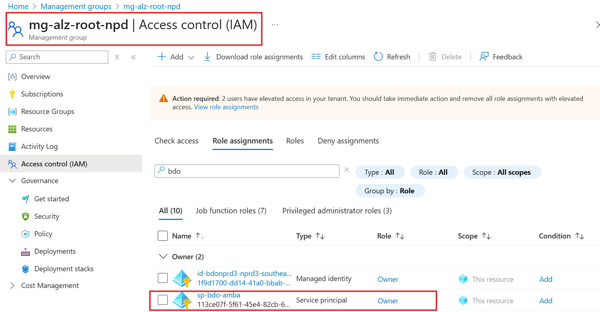
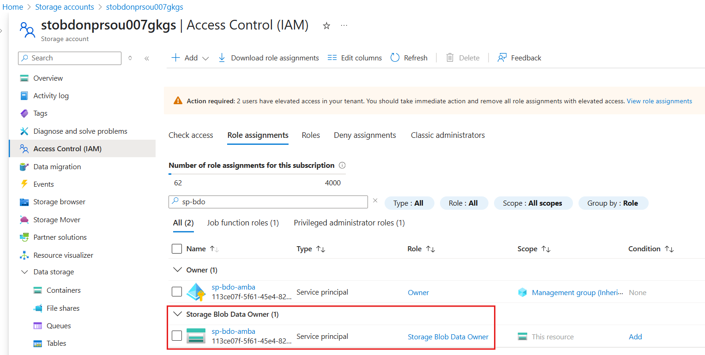
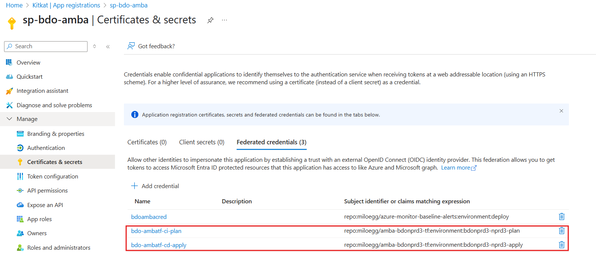

As per AMBA prerequisites at https://azure.github.io/azure-monitor-baseline-alerts/patterns/alz/HowTo/deploy/Introduction-to-deploying-the-ALZ-Pattern/ , a Deployment Identity with Owner permissions to the pseudo root management group. This permission is necessary for the Service Principal Account to create role-based access control assignments.

Hence to run this code, another service principal is created with the abovementioned permissions and used for OIDC with this GH repository

This same service principal is used across both plan and apply environments for this repository

The deployment uses the same GH runners and storage account for tfstate as the ALZ bootstrap deployment. It uses modified reusable workflows (different concurrency) from the ALZ 

## SPN with owner permissions on intermediate root group

## SPN with Storage Blob Data Owner permissions to read tfstate

## SPN Federated Identity

